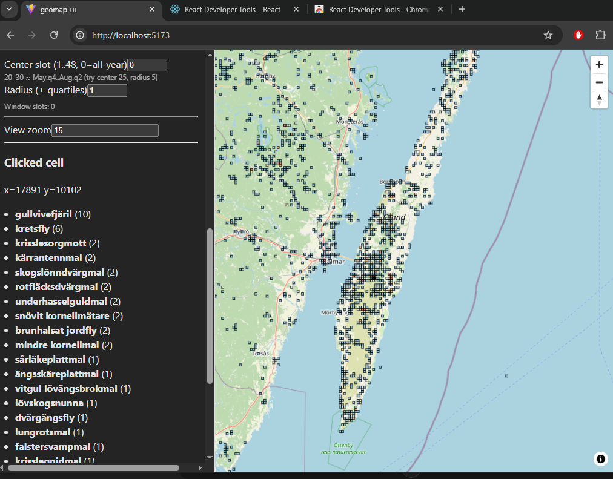

# boston_geomap


Build and explore biodiversity “hotmaps” from Artportalen / Artdatabanken SOS GeoGridAggregation data.

This repo:
1) fetches per-taxon geogrid layers from SOS for a **base zoom**  
2) materializes **derived zooms locally** (aggregate child tiles into parent tiles)  
3) builds a **hotmap** (coverage + score per tile)  
4) exports **GeoJSON + CSV** suitable for GUI overlays and ranking nearby hotspots

> Works with **time slots** (`slot_id`) to model seasonal occurrence patterns.

---

## What you get

- **SQLite cache** of per-taxon grid tiles (`taxon_grid`) keyed by `(taxon_id, zoom, slot_id, x, y)`
- **Hotmap tiles** (`grid_hotmap`) per `(zoom, slot_id)` with bbox + score
- **Exports**:
  - `data/out/hotmap_zoom{zoom}_slot{slot}.geojson`
  - `data/out/top_sites_zoom{zoom}_slot{slot}.csv`
- **Tools**:
  - end-to-end pipeline runner
  - `rank_nearby.py` distance-weighted ranking
  - cache/derived cleanup helper

---



## Quick start

### 1) Create and activate a venv
```bash
python3 -m venv .venv
source .venv/bin/activate
pip install -r requirements.txt

### 2) Configure secrets

Create settings.env (not committed) and export it:
set -a
source settings.env
set +a

Expected env vars:

ARTDATABANKEN_SUBSCRIPTION_KEY

ARTDATABANKEN_AUTHORIZATION

### 3) Run pipeline

Example: 100 taxa, slot 0, build zooms 15→14→13, export each:

./scripts/run_geomap_pipeline.py --n 100 --slot 0 --zooms 15,14,13

### Concepts
Time slots (slot_id)

A slot is a coarse “calendar bin” used to model seasonal patterns.
You can use geomap/timeslots.py to map dates to slots (or later hook GUI date selection to slot selection).

## Zooms

We fetch only the highest zoom (smallest tiles) from SOS and aggregate locally for lower zooms.

## Why?
It reduces API calls, keeps the most precise geometry at the base layer, and ensures zoomed-out views remain consistent.


### How local zoom aggregation works (tile math)

## If you fetch zoom Z and want zoom Z-1:
o parent_x = floor(child_x / 2)
o parent_y = floor(child_y / 2)
o parent bbox is the union of the four children’s bboxes (or computed via tile bounds)

## For each (taxon_id, slot_id) we aggregate:
o observations_count = sum(child observations)
o taxa_count = sum or max (depending on SOS semantics; currently stored but not used for scoring)
o bbox = union of child bboxes

### Scoring

## Hotmap is computed per tile as:
o coverage = number of distinct taxa present in the tile (within the active taxa set)
o obs_total = summed observations across that taxa set (via view)
o score = (coverage ** alpha) / ((obs_total + 1) ** beta)
## Tune via:
o --alpha
o --beta

### Project layout
geomap/              core library modules (storage, SOS client, scoring, tiles)
scripts/             CLI scripts (fetch, build, export, rank, pipeline)
data/db/             SQLite DB (local cache) [gitignored]
data/out/            exports (GeoJSON/CSV) [gitignored]
logs/                run logs [gitignored]
settings.env         local secrets [gitignored]

### Common commands
## Fetch + materialize zooms
./scripts/fetch_layers.py --n 100 --slot 0 --zooms 15,14,13

## Build hotmap for one zoom
./scripts/build_hotmap.py --n 100 --slot 0 --zoom 14 --alpha 2 --beta 0.5

## Export for one zoom
./scripts/export_hotmap.py --zoom 14 --slot 0

## Rank nearby hotspots
./scripts/rank_nearby.py --slot 0 --zoom 14 --lat 55.667 --lon 13.35 --max-km 70 --limit 10 --show-all-taxa

## Clean derived outputs safely
./scripts/clean_derived.py --all

### Status

## This is an experimental tooling repo. The schema and scoring are evolving as we add:
o calendar-aware layers
o GUI integration
o richer metadata for taxa and occurrence windows


---


## Pipeline overview

```mermaid
flowchart TD
    A[run_geomap_pipeline.py] --> B[fetch_layers.py]

    B -->|Fetch base zoom Z from SOS| C[(taxon_grid<br/>zoom=Z)]
    B -->|Cache SHA| D[(taxon_layer_state)]

    C -->|Local aggregation| E[(taxon_grid<br/>zoom=Z-1)]
    E -->|Local aggregation| F[(taxon_grid<br/>zoom=Z-2)]

    C --> G[build_hotmap.py]
    E --> G
    F --> G

    G --> H[(grid_hotmap)]
    G --> I[(hotmap_taxa_set)]

    H --> J[export_hotmap.py]
    J --> K[GeoJSON<br/>hotmap_zoomX_slotY.geojson]
    J --> L[CSV<br/>top_sites_zoomX_slotY.csv]

    H --> M[rank_nearby.py]
    M --> N[Distance-weighted ranking]

    subgraph Cache safety
        D -->|Validate| E
        D -->|Invalidate| G
    end


---
### GUI Flow
sequenceDiagram
  autonumber
  actor U as User
  participant UI as React GUI
  participant API as Local API (geomap)
  participant DB as SQLite (geomap.sqlite)
  participant SOS as ArtDatabanken SOS API
  participant QGIS as QGIS / Map renderer

  U->>UI: Choose position (lat/lon)
  U->>UI: Choose slot_id (0..47) + hysteresis (optional)
  U->>UI: Choose base zoom (e.g. 15) + derived zooms (e.g. 14,13)
  U->>UI: Choose N species (0 = all)
  U->>UI: Click "Build / Refresh"

  UI->>API: POST /pipeline {slot_id, zooms, n, alpha, beta}
  API->>DB: ensure_schema()

  loop each taxon_id
    API->>DB: get_layer_state(taxon_id, base_zoom, slot_id)
    alt cache miss or sha changed
      API->>SOS: GeoGridAggregation(taxon_id, base_zoom, filters incl. slot)
      SOS-->>API: gridCells + bboxes
      API->>DB: replace_taxon_grid(taxon_id, base_zoom, slot_id, gridCells)
      API->>DB: upsert_layer_state(taxon_id, base_zoom, slot_id, sha, nCells)
      API->>DB: materialize derived zooms from base (local aggregation)
      API->>DB: upsert_layer_state(... dst_zoom ... payload_sha256="LOCAL_FROM_...")
    else cache hit
      API->>DB: (optional) verify derived zooms exist; rebuild if missing/stale
    end
  end

  loop each zoom in zooms
    API->>DB: rebuild_hotmap(zoom, slot_id, active_taxa_set, alpha, beta)
    API->>DB: export geojson/csv (optional on-demand)
  end

  API-->>UI: Done + available layers {zoom, slot_id}

  U->>UI: View hotspots map (choose zoom)
  UI->>API: GET /hotmap?zoom=&slot_id=
  API->>DB: SELECT from grid_hotmap/grid_hotmap_v
  API-->>UI: GeoJSON FeatureCollection (polygons + properties)
  UI->>QGIS: Render layer (MapLibre/Leaflet) + optional WMS/WMTS basemap

  U->>UI: Click a cell polygon
  UI->>API: GET /cell_taxa?zoom=&slot_id=&x=&y=
  API->>DB: SELECT from grid_hotmap_taxa_names_v ORDER BY observations_count DESC
  API-->>UI: taxa list (sv name, sci name, obs)

  U->>UI: Run "Rank nearby"
  UI->>API: GET /rank_nearby?lat=&lon=&zoom=&slot_id=&max_km=&mode=
  API->>DB: SELECT candidates from grid_hotmap_v WHERE zoom=? AND slot_id=?
  API-->>UI: ranked list + optional expanded taxa per cell

## Development

For local development setup (Debian/Ubuntu, Python backend, and Node 24 frontend),
see [docs/DEVELOPMENT.md](docs/DEVELOPMENT.md).